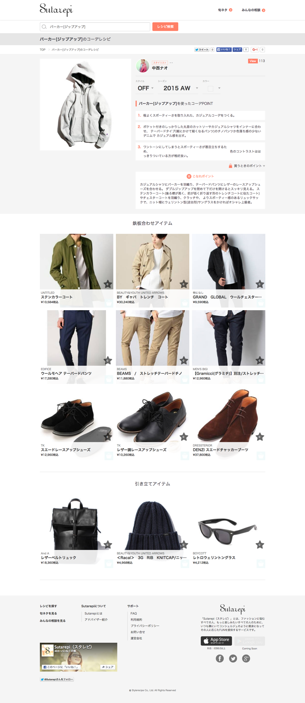

## スタイルレシピの作り方

  
株式会社スタイルレシピ  
山内雅浩  
@algas  

---

## Agenda

1. 自己紹介＆会社紹介
2. 開発会社になる3つのステップ
3. サービスを分析してわかった５つのこと(仮)
4. まとめ

---

## 自己紹介

* 氏名: 山内雅浩 @algas
* 言語: 好きな言語はHaskellとPython。
* 初体験: MSX Basic を小学校1年で触った。
* 学生時代: 大学院博士課程まで人工衛星の開発をしていた。
* 前職: ゲーム開発会社の創業メンバの１人として開発に関わるほぼすべてを一通り担当した。  
* 現職: 2015年8月より1人目の開発者としてスタイルレシピに参画する。

---

## 会社紹介

日本最大のファッションレシピサービス「スタレピ」  
を運営しています！  
http://www.sutarepi.net

--

### スタレピとは？

無料でファッションレシピを検索できます。  
例えば「パーカー」のレシピを検索すると、  
パーカーに関するファッションのレシピを見ることができます。  
あなたが持っている洋服のレシピもきっと見つかります！

--

### レシピの一例

--

### 主な機能

* レシピ (某料理レシピサービスのファッション版)
* 旬ネタ (ニュース)
* みんなの相談 (スタイリストに無料でファッション相談)

---

## 開発会社になる3つのステップ

1. 開発基盤を構築する
2. 開発環境を構築する
3. 開発文化を構築する

---

## 1. 開発基盤を構築する

--

### 優秀な開発者たち

| 業種 | 人数 |
|---|---|
| エンジニア | 3.2 |
| デザイナ | 0.6 |
| インターン | 0.4 |

* 週5日を1.0人日としています
* 内定者も加えるとさらに数人おります

---

## 2. 開発環境を構築する

--

### 改革したツール

|  | 以前 | 現状 |
|---|---|---|
| メール | さくらメール | Google Apps |
| チャット | LINE | Slack |
| ファイル共有 | Dropbox | Google Drive |
| リポジトリ | Subversion | Github, Bitbucket |
| タスク管理 | - | Redmine |
| 画像共有 | - | Gyazo |

---

## 3. 開発文化を構築する

--

## Not only tool,
## but also culture!

ツールを導入するだけでは不十分で開発文化も導入しなければならない。

--

## 非開発会社あるある(実話)

私が一人目の開発者として参画する前の状況です。

--

### データのフォーマットが統一されていない

* 新サービスのファッションレシピの作成をスタイリストに依頼した。
* 本来であれば管理ツールから入力してもらうが、管理ツールがまだ出来ていない。
* Excelでレシピの作成を依頼したが担当者ごとにバラバラ。

↓  
データ入力だけに1人月くらい消費した。

--

### 不具合があったら全て開発会社のせい

* ビジネスロジックの問題か仕様伝達の問題なのにも関わらずすべて開発会社のせいにしていた。  
* 開発会社にしても問題の根本原因は解決しない。  

↓  
企画の段階から介入することでロジックの作成や仕様伝達の不備を減らした。

--

### 検証環境を活用しない

* 開発者じゃない人が仕様を作っていたので、特に管理ツール系の仕様策定が杜撰。  
* 仕様が杜撰なので出来上がってくるものの品質も当然良くない。  
* 品質が良くないという認識があるのに検証環境で十分にテストしない。  
* 本番環境で運用中にバグが見つかり差し戻すも開発時間や工数が掛かり過ぎる。  

↓  
本番環境のデータを検証環境に戻すことで現実感を持って操作できる。

--

## チームを改善する毎日

私が参画してから大部分を改善しました。  
今後もダメな文化を少しずつ排除しています。  
不完全な部分の改善は今後の課題。  

↓  
改善するのも楽しんでいる。

---

## サービス分析

--

## 検索キーワード(抜粋)

実際にスタレピで検索された  
キーワード一覧

--

## メジャーなキーワード

ニット ←寒くなりましたね

--

## メジャーなキーワード

(色名) (アイテム名) ←流行色？

--

### マイナーなキーワード

宇宙柄ワンピ ←ちょっと前に流行った？

---

## 男性向けのレシピがランキング上位に

メインターゲットは女性向けに作ったが、  
意外と男性にも使われているようです。  

---

## まとめ

---

## 人材採用

一緒にサービスを作り直してくれる  
優秀なエンジニアを募集しています！

株式会社スタイルレシピ

recruit@stylerecipe.co.jp

--

## スタイルレシピのいいところ

* 開発者の裁量が大きい
企画から広い範囲に携われます。
* 自社サービス開発しかやってない
自分たちで使う言語やフレームワークを選定できます。
* レベルの低い技術者は採用しない
面接時にプログラミングテストを実施して技術力を確認しています。

--